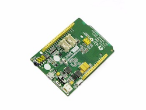
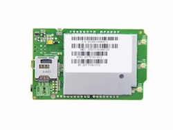
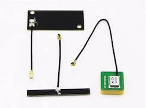
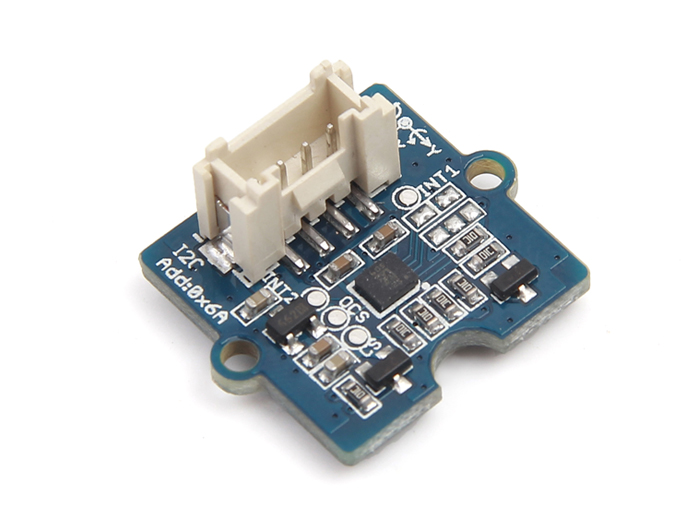

##### In progress... :)

## Moto crash project (Linkit One version)

### Send an SMS to your emergency contact in case of accident with your motorcycle

### WHAT IS ARDUINO?

Arduino is an open-source electronics platform based on easy-to-use hardware and software. It's intended for anyone making interactive projects.

This is the manufacturer's website:

[Arduino website](https://www.arduino.cc "Arduino")

To program for Arduino, you need to download the Integrated development environment (IDE):

[Arduino software website](https://www.arduino.cc/en/Main/Software "Arduino Software")

### LINKIT ONE BOARD

For this project, I found an Arduino board that integrated all the modules I needed and had a good price: Linkit One.

The LinkIt ONE development board is an open source, high-performance board for prototyping Wearables and IoT devices. It's based on the world's leading SoC for Wearables, MediaTek Aster (MT2502) combined with high-performance Wi-Fi (MT5931) and GPS (MT3332) chipsets to provide you with access to all the features of MediaTek LinkIt. It also provides similar pin-out features to Arduino boards, making it easy for you to connect to various sensors, peripherals, and Arduino shields.

This is the manufacturer's website:

[SeedStudio website](https://www.seeedstudio.com "SeedStudio")

In order to use this board with the Arduino IDE, you need to follow some steps:

[Linkit One Guide website](https://docs.labs.mediatek.com/resource/linkit-one/en "SeedStudio")

### GROVE 6-AXIS ACCELEROMETER & GYROSCOPE

Grove 6-Axis Accelerometer & Gyroscope is a cost-effective Grove sensor integrated with a 3-axis digital accelerometer and a 3-axis digital gyroscope.

With a serious low power consumption digital chip LSM6DS3 and power supply regulator inside, it features high sensitivity, green tech and low noise interference. It can be configured to different sensitivity levels of acceleration and different angular rate measurement range. Provided with detailed SDK, it can make the prototyping process quicker and easier.

This product can be used for different applications for tilt, motion, and tap sensing, such as robotics, IoT devices and consumer electronic devices.

This module is used to send movement alert by SMS and not consume battery sending data if they are not necessary to the server.

[Grove 6-Axis Accelerometer & Gyroscope for Linkit One](https://www.seeedstudio.com/Grove-6-Axis-Accelerometer%26Gyroscope-p-2606.html "Grove 6-Axis Accelerometer & Gyroscope for Linkit One")

### INSTRUCTIONS

You have to add a SIM card in your Linkit One with the PIN code deactivated in order to use the GPRS connection, in addition, I use a card with SMS to be able to communicate with the motorcycle, as well as over the Internet, by normal SMS.

I use FreedomPop SIM, it is free with:

- 200 mb for data
- 300 SMS
- 100 minutes for call

[FreedomPop website](https://es.freedompop.com/es?experience=organic.default "FreedomPop")

Once you have everything configured in the Arduino IDE to use your new Linkit One board, you can already clone this repository on your computer and access the MotoCrashProject folder and open the <b> MotoCrashProject.ino</b> file.

You need to download and install two libraries that are used in the project in the Arduino IDE:

[ArduinoJson in GitHub](https://github.com/bblanchon/ArduinoJson "ArduinoJson")

[elapsedMillis in GitHub](https://github.com/pfeerick/elapsedMillis "elapsedMillis")

[Accelerometer and gyroscope LSM6DS3 in GitHub](https://github.com/Seeed-Studio/Accelerometer_And_Gyroscope_LSM6DS3 "Accelerometer and gyroscope LSM6DS3")

### LICENSE

This project is free and use <b>CC BY-NC-SA</b>.

This license lets others remix, tweak, and build upon your work without for commercial purposes, as long as they credit you and license their new creations under the identical terms.

### THANK YOU

Nothing else, if you want to improve the Linkit One code, do not hesitate to share it with me. For any question you have, you can write me.

Thank you very much! I hope you like it!

##### ArtCC 2018++